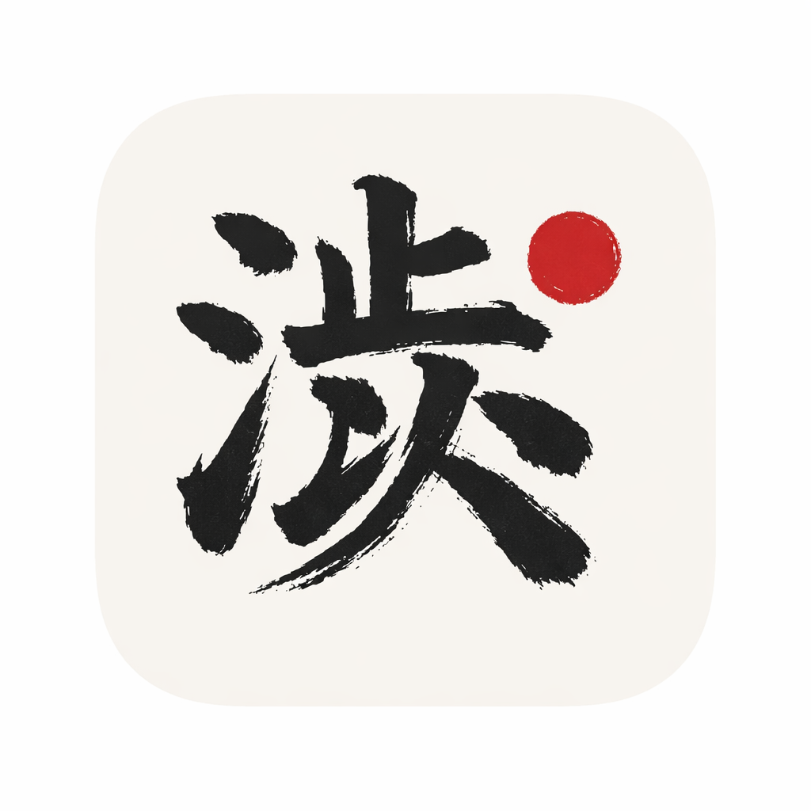

# Shibui-Code

Shibui-Code is a distraction-free macOS code scribbling app for deliberate coding practice.



## Why this exists

Most editors optimize for large projects and productivity workflows. Shibui-Code optimizes for focused thinking in temporary scratch sessions.

## Who it is for

- Developers practicing syntax and problem-solving
- Interview prep sessions
- Teaching/demo sessions where persistence is unnecessary
- Anyone who wants a clean, low-distraction editor shell without any helping tools

## Why it is technically interesting

- Native desktop host in C++20 with macOS webview backend
- C++ core extracted into a reusable/testable library
- Embedded TypeScript/CodeMirror 6 frontend bundled into a native header
- Strict no-persistence runtime constraints
- Unified build/test/packaging entrypoint via CMake + Ninja + CTest

## Install

### Global CLI install

```bash
npm install -g shibui-code
```

### Launch

```bash
shibui-code
```

The package builds a native binary during install/first launch when needed.

## Hello world in 30 seconds

```bash
shibui-code
```

Inside the app:

1. Press `Ctrl+N` for a new tab.
2. Press `Ctrl+L` and choose a language.
3. Type code.
4. Close the app to copy the full session snapshot to your clipboard.

See [examples/hello-world/README.md](examples/hello-world/README.md) for a minimal walkthrough.

## Key features

- Multi-tab temporary editor sessions
- Language selection for common programming languages
- Theme search mode (`Ctrl+T`) with fuzzy matching
- Static diagnostics (syntax errors, trailing whitespace, long lines)
- Clipboard snapshot export on app close
- No telemetry, plugins, cloud sync, or hidden background services

## Keyboard shortcuts

- `Ctrl+N`: new tab
- `Ctrl+W`: close tab
- `Ctrl+T`: open theme search mode
- `Ctrl+L`: open language selector
- `Ctrl+1..9`: switch tabs

## Architecture and design choices

- Build/test orchestrator: CMake presets + Ninja + CTest
- Core backend: C++ static library in `backend/`
- App wrapper: thin native shell in `app/`
- Frontend: TypeScript + CodeMirror 6 in `frontend/`
- Bridge boundary: versioned/typed contract validated in C++ and TS tests
- Test layers: GoogleTest/gMock, Vitest, Playwright, pytest integration contracts

Details:
- [docs/architecture.md](docs/architecture.md)
- [docs/coverage.md](docs/coverage.md)
- [docs/packaging.md](docs/packaging.md)

## Tradeoffs and limitations

Shibui-Code intentionally does not support:

- File save/load
- Session persistence
- Code completion/snippets/refactoring
- Plugin ecosystems
- External API calls and telemetry

This app is not meant as a full IDE and is intentionally kept bare bones for maximum focus.

## Local development

```bash
cmake --preset dev
cmake --build --preset dev
ctest --preset dev --output-on-failure
```

## Quality checks

```bash
ctest --preset ci --output-on-failure
bash scripts/coverage.sh
bash scripts/security.sh
```

## Packaging

```bash
bash scripts/package-macos.sh
```

## Roadmap

- Add richer bridge contract fixtures and golden serialization tests
- Expand smoke coverage against signed app bundles
- Publish reproducible release notes per version
- Tighten native error reporting for missing runtime deps

## Security and contribution

- [CONTRIBUTING.md](CONTRIBUTING.md)
- [SECURITY.md](SECURITY.md)
- [CODE_OF_CONDUCT.md](CODE_OF_CONDUCT.md)

## Release process

Use [docs/release-checklist.md](docs/release-checklist.md) before tagging and publishing.
